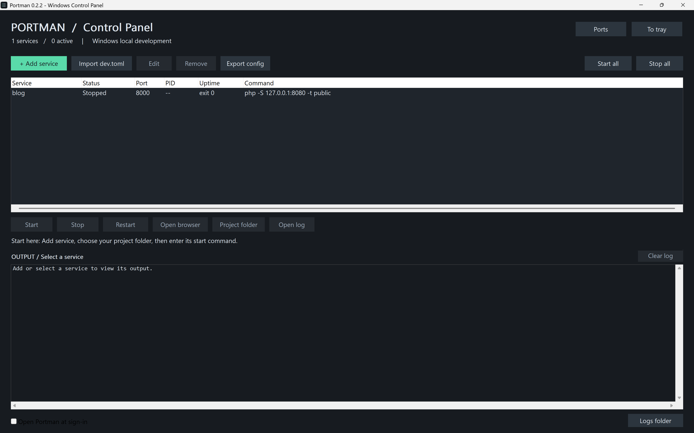
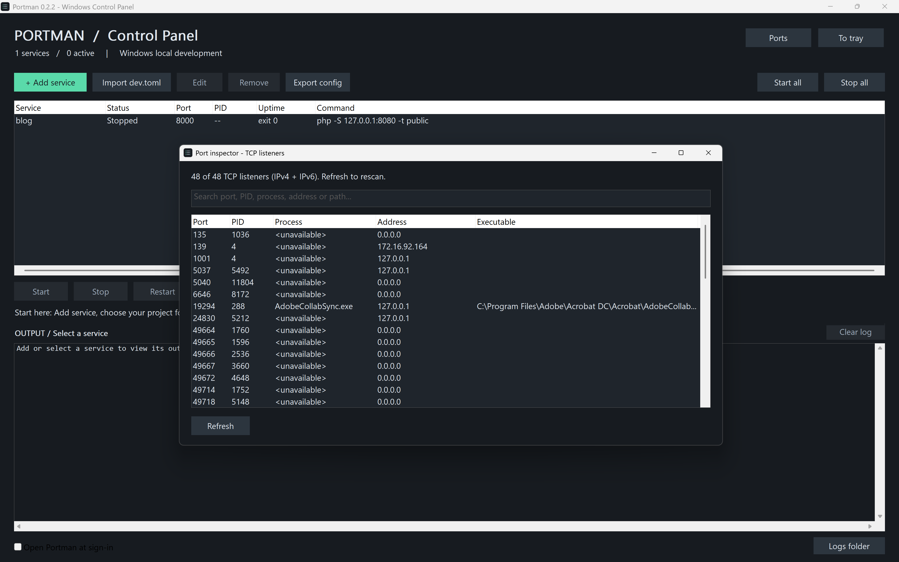
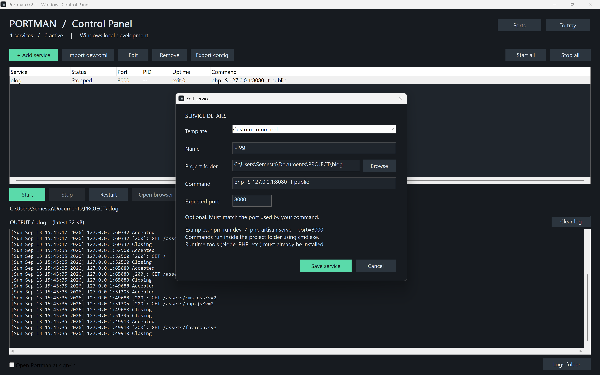
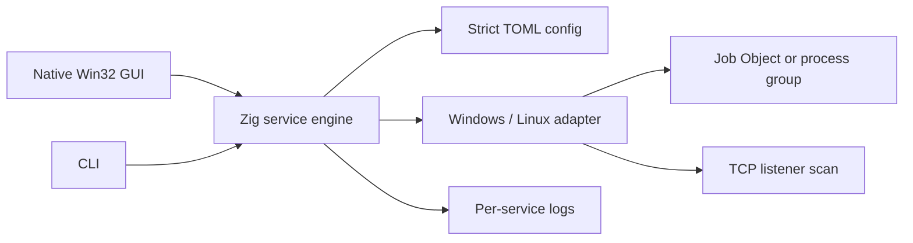

# Portman

[](https://github.com/rezz990/Portman/actions/workflows/ci.yml)
[](https://github.com/rezz990/Portman/releases)
[](LICENSE)
[](#installation)

**Portman is a lightweight local development control panel for Windows.** It keeps your project services in one place so you can start, stop, inspect, and read their output without opening several terminals. It is built with Zig and a native Win32 GUI, so the installed app does not need a browser, Electron, .NET, Node.js, or Zig runtime.

Portman is designed for the workflow behind projects such as Next.js, Vite, Laravel, PHP, Bun, Python, Android APIs, and local databases. It does not install those runtimes or rewrite their project configuration. You provide the command and Portman manages the process tree around it.

> **Current status:** `0.2.2` is a Windows GUI preview. The Windows x64 binaries compile successfully and the service engine/CLI suites pass in local validation. A GitHub Actions workflow is included for repeatable CI. Native Windows acceptance should still be run before using the preview for an important database or production-like environment.

<!-- Replace the included placeholders with real captures listed in docs/SCREENSHOTS.md. -->



_Portman control panel with service._



_Listening service and output._



_Port inspector._

## Why Portman exists

A normal development session often becomes a row of terminals:

```text
terminal 1  →  npm run dev
terminal 2  →  php artisan serve
terminal 3  →  bun run dev
terminal 4  →  database or API worker
terminal 5  →  finding which process owns port 3000
```

Portman turns that routine into a small workspace:

```text
Open Portman → Add service → choose folder → enter command and port → Start
```

Each service has a visible status, PID, uptime, expected port, command, and output log. When a service is stopped, Portman cleans up the process tree it launched. When the configured port is already occupied, Portman explains the conflict before starting anything.

## Features

### Windows desktop panel

- Native Win32 GUI with a dark charcoal interface.
- Persistent Services, Ports, Settings, and About navigation with clear active and keyboard-focus states.
- Service table with status, port, PID, uptime, and command.
- Add, edit, remove, start, stop, restart, start all, and stop all.
- Double-click a service to edit it.
- Service editor templates for custom commands, npm, Bun, Laravel/PHP, PHP's built-in server, and Python HTTP server.
- Project folder picker and validation before saving.
- Responsive split workspace for the service list, selected-service guidance, and a readable monospace log tail; sizing is DPI-aware.

### Service lifecycle

- Starts commands in their configured working folder.
- Uses Windows Job Objects so Stop can terminate the managed process tree.
- Detects whether the expected TCP port is owned by the service tree.
- Classifies `Stopped`, `Starting...`, `Listening`, `Running`, `Check port`, and `Failed` states.
- Shows nonzero exit codes after a service terminates.
- Detects an existing listener before Start and leaves the foreign process untouched.
- Stops all managed services when you choose Exit.

### Logs and diagnostics

- Captures stdout and stderr to one log per service.
- Shows a bounded output tail inside the panel.
- Opens the full log file or the logs folder.
- Rotates a log to `.previous` when it exceeds 5 MiB at the next service start.
- Port Inspector lists TCP listeners across IPv4 and IPv6 with port, PID, process, address, and executable path.
- Port Inspector has a live search field for port, PID, process name, address, or executable path.
- Read-only inspection never kills arbitrary Windows processes.

### Workspace and install flow

- Import a trusted `dev.toml` file without executing it automatically.
- Export the current service list for backup or sharing.
- Atomic configuration writes with temporary files and rename.
- System tray mode with Open Portman and Exit actions.
- Optional “Open Portman at sign-in” setting; it opens the panel but does not auto-start services.
- Per-user installer, Start menu shortcut, optional desktop shortcut, and Windows uninstaller.
- Portable `Portman.exe` is included for users who do not want an installation.

## Installation

### Installer (recommended)

1. Download `Portman-Setup-0.2.2.exe` from the GitHub Release page.
2. Run it as the normal Windows user who will use Portman.
3. Leave **Create desktop shortcut** and **Open Portman after installation** enabled if desired.
4. Click **Install**.
5. Open Portman from the Start menu or desktop shortcut.

The installer targets Windows 10/11 x64, installs to `%LOCALAPPDATA%\\Programs\\Portman`, and uses the current user's folders and registry. It is designed to run without an administrator password and does not add the CLI to PATH. The preview installer is unsigned, so compare the release checksum and download it from the project's official release page.

Portman itself is self-contained. Commands such as `npm run dev`, `php artisan serve`, `bun run dev`, or `python -m http.server` still require Node.js, PHP, Bun, Python, or the relevant runtime to be installed separately. Restart Portman after changing PATH.

### Portable mode

Extract the release archive and run `portable/Portman.exe`. Portable mode does not create shortcuts or an uninstaller. It uses the same `%LOCALAPPDATA%\\Portman` data directory as the installed GUI, so services and logs remain available if you later install the application.

## First run

The quickest useful demo needs no web framework:

1. Open **Add service**.
2. Name it `demo-worker`.
3. Choose an existing folder such as `C:\\Temp`.
4. Set the command to `echo Portman-jalan & ping -t 127.0.0.1 >nul`.
5. Leave Expected port empty.
6. Save and press **Start**.
7. Confirm `Running`, a PID, uptime, and output in the log panel.
8. Press **Stop**. Portman terminates the managed `ping.exe` tree.

For a web project, set Expected port to the port your command actually binds:

| Project | Command | Expected port |
|---|---|---:|
| Next.js | `npm run dev` | `3000` |
| Vite | `npm run dev -- --host 127.0.0.1 --port 5173 --strictPort` | `5173` |
| Bun | `bun run dev` | `3000` |
| Laravel | `php artisan serve --host=127.0.0.1 --port=8000` | `8000` |
| PHP built-in server | `php -S 127.0.0.1:8000` | `8000` |
| Python static preview | `python -m http.server 8080 --bind 127.0.0.1` | `8080` |

Expected port is a check and status signal. Portman does not rewrite the command, `package.json`, `.env`, Laravel config, or server arguments. If your command uses a different port, update both the command and Expected port yourself.

## Status meanings

| Status | Meaning |
|---|---|
| **Stopped** | No process is currently managed for the service. |
| **Starting...** | The process is alive and Portman is waiting for the expected TCP listener. |
| **Listening** | The expected TCP port is visible and belongs to the service process tree. |
| **Running** | The process is alive and no expected port was configured. |
| **Check port** | The process is alive but the expected port is missing, foreign, or could not be verified after the wait window. |
| **Failed** | Portman could not launch the command, the process exited nonzero, or process inspection failed. |

`Listening` is a TCP check, not an HTTP health check. `Open browser` opens `http://127.0.0.1:<port>` and is intended for HTTP services. It does not infer HTTPS, custom hostnames, databases, or other protocols.

## Configuration

The GUI stores services in `%LOCALAPPDATA%\\Portman\\services.toml`. Portman also imports a strict subset of TOML:

```toml
[project]
name = "my-workspace"

[[services]]
name = "web"
command = "npm run dev"
cwd = "C:/Projects/my-web"
port = 3000

[[services]]
name = "api"
command = "php artisan serve --host=127.0.0.1 --port=8000"
cwd = "C:/Projects/my-api"
port = 8000
```

Supported fields and validation rules are documented in [`docs/CONFIGURATION.md`](docs/CONFIGURATION.md). Unknown fields, duplicate fields, duplicate names/ports, invalid ports, malformed strings, and unsafe Windows device names are rejected. A failed load reports a line and error without overwriting the existing file.

**Export config** writes only the service definitions. It does not include logs, PIDs, runtime state, environment variables, secrets, or project files. Review absolute paths and commands before sharing an export.

## Architecture



The code is intentionally split so the lifecycle and configuration logic can be tested without rendering the GUI:

- `src/desktop.zig` — persistence, import/export, validation, service state, lifecycle, logs, C ABI exports.
- `src/desktop.c` — Win32 windows, controls, editor, tray, startup setting, file/folder dialogs, confirmations.
- `src/platform.c` — TCP listener scan, process identity, Windows Job Objects, Linux process groups/pidfds.
- `src/config.zig` — strict TOML subset parser and parser tests.
- `src/main.zig` — CLI commands and the original terminal workflow.
- `windows/setup.c` and `windows/setup.zig` — per-user installer and uninstaller.

More detail is in [`docs/ARCHITECTURE.md`](docs/ARCHITECTURE.md).

## CLI

The Windows CLI is named `portman-cli.exe` so it can coexist with the GUI executable `Portman.exe` on a case-insensitive filesystem:

```powershell
.\\portman-cli.exe list
.\\portman-cli.exe inspect 3000
.\\portman-cli.exe watch
.\\portman-cli.exe check dev.toml
.\\portman-cli.exe up dev.toml
.\\portman-cli.exe logs web dev.toml --tail 80
```

`kill` and `free` require confirmation and a matching PID. Windows termination requires `--force`. The CLI reference is kept in [`docs/CLI-v0.1.md`](docs/CLI-v0.1.md); the desktop panel is the main Windows workflow.

## Building from source

Portman pins Zig **0.14.1**. Use the same compiler locally and in CI.

### Linux or WSL CLI build

```bash
python -m pip install ziglang==0.14.1
python -m ziglang fmt --check build.zig src/main.zig src/config.zig src/desktop.zig windows/setup.zig
python -m ziglang build test
python -m ziglang build test-desktop
python tests/integration.py zig-out/bin/portman
```

### Windows x64 release build

From the repository root:

```powershell
python -m pip install ziglang==0.14.1
python scripts/build_windows.py
```

If Zig is installed outside Python:

```powershell
python scripts/build_windows.py --zig C:\\tools\\zig\\zig.exe
```

The script verifies Zig 0.14.1, builds the GUI and CLI for `x86_64-windows-gnu`, places fresh payload files under `windows/payload`, then builds `Portman-Setup-0.2.2.exe`. It also prepares a portable Windows ZIP, a clean source ZIP, and `dist/SHA256SUMS.txt`. Release output is under `dist/`; binaries and the installer are under `dist/windows-release/bin/`. `.pdb` files are debugging symbols and are not required to run the app.

Prepared files are `Portman-Setup-0.2.2.exe`, `Portman-0.2.2-windows-x64.zip`, and `Portman-0.2.2-source.zip`. The source archive excludes Git metadata, caches, compiler output, installer payload staging, and previous release output. Nothing in the build script uploads or publishes an artifact.

Do not commit `.zig-cache`, `zig-out`, `.pdb`, `windows/payload`, personal runtime data, or `%LOCALAPPDATA%\\Portman` files. The repository `.gitignore` covers generated build output and payloads.

## Testing

The repository has three layers of validation:

```bash
python -m ziglang build test             # parser tests
python -m ziglang build test-desktop     # persistence/lifecycle/port tests
python tests/integration.py zig-out/bin/portman
```

The included CI workflow runs formatting, parser tests, desktop-engine tests, and CLI integration tests on Linux and Windows. The Windows runner also produces the Windows binaries as an artifact. Native GUI acceptance remains a manual step because it needs a real Windows desktop, tray, display scaling, file picker, installer, and Windows Settings session.

Read [`TESTING.md`](TESTING.md) for the complete acceptance checklist and [`docs/TROUBLESHOOTING.md`](docs/TROUBLESHOOTING.md) for common failures.

## Security and process behavior

Portman executes the command you configure. Treat imported configurations and service commands as code. Do not import an untrusted `dev.toml`, and do not place passwords or tokens in commands because stdout/stderr are written to logs.

On Windows, Stop force-terminates the Job Object process tree managed by Portman. It is reliable for foreground development commands and their child processes, but it is not a database-specific graceful shutdown hook. Stop databases using their own shutdown procedure when data integrity matters. Commands that daemonize, use `start`, break away from the Job Object, or run through a service broker may not be fully observable.

The Port Inspector is read-only. It can show limited process metadata when Windows permissions allow it; it does not elevate or terminate arbitrary processes.

See [`SECURITY.md`](SECURITY.md) for vulnerability reporting.

## Contributing

Issues and focused pull requests are welcome. Before changing lifecycle behavior, read [`docs/ARCHITECTURE.md`](docs/ARCHITECTURE.md), run the test suites, and explain Windows-specific behavior in the PR. GUI changes need a screenshot or a native Windows test note. Use the issue forms and pull request checklist under `.github/`.

See [`CONTRIBUTING.md`](CONTRIBUTING.md), [`CODE_OF_CONDUCT.md`](CODE_OF_CONDUCT.md), and [`SUPPORT.md`](SUPPORT.md).

## Roadmap

The next priorities are graceful stop hooks, restart policy with bounded backoff, dependency readiness for Start all, live log rotation, environment-file support with redaction, richer health checks, code signing, and optional Windows background-service integration. The detailed list is in [`ROADMAP.md`](ROADMAP.md).

## Screenshots

The repository includes clearly marked placeholder images. Replace them with captures listed in [`docs/SCREENSHOTS.md`](docs/SCREENSHOTS.md) and keep them under `docs/images/`. The screenshot guide explains the exact state to show and how to remove private paths, usernames, IPs, credentials, and unrelated tabs before committing images.

## License

Portman is released under the [MIT License](LICENSE). The bundled binaries are unsigned previews; Windows system libraries and the Zig toolchain remain subject to their own licenses.

## Acknowledgements

- [Zig](https://ziglang.org/) for the compiler and standard library.
- Win32 APIs for the native Windows frontend, TCP inspection, process identity, Job Objects, shortcuts, and installer integration.
