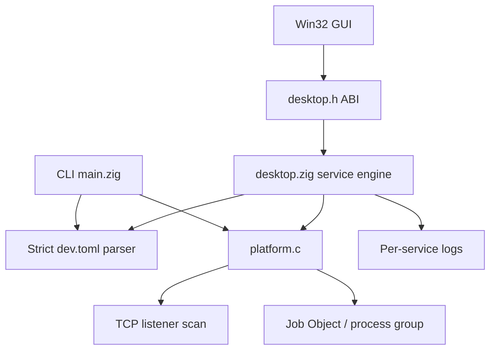
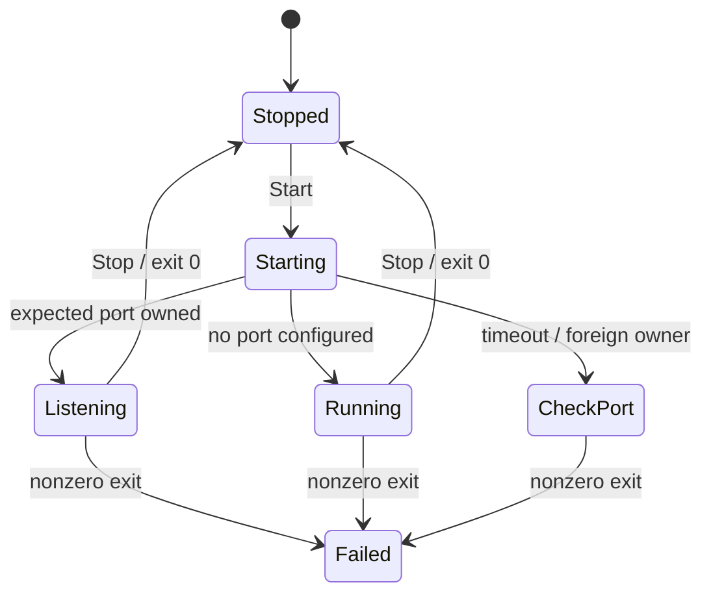

# Architecture

Portman is split into a small platform layer, a Zig service engine, and a native Windows frontend.

## Responsibilities

- `src/desktop.c` owns Win32 windows, controls, drawing, tray behavior, folder/file dialogs, startup preference, and user confirmations.
- `src/desktop.zig` owns UTF-8 service data, atomic persistence, import/export, port conflict checks, process lifecycle state, log tailing, and testable C ABI functions.
- `src/config.zig` parses a deliberately strict TOML subset. Unknown keys, duplicate fields, duplicate names/ports, unsafe names, invalid ports, and malformed strings are rejected.
- `src/platform.c` is the operating-system adapter. Windows uses TCP tables, process identity checks, and Job Objects. Linux uses `/proc`, pidfds, process groups, and signals.
- `windows/setup.c` and `windows/setup.zig` build a self-contained per-user installer. It writes binaries through temporary files, registers an uninstaller, creates shortcuts, and keeps runtime data separate.

## Runtime data

The installed GUI stores configuration and logs under `%LOCALAPPDATA%\Portman`. The repository never reads this directory during build. A service command is started in its configured working directory using `cmd.exe /d /s /c` on Windows or `/bin/sh -c` on Linux.

## State model

`Listening` verifies a TCP listener and process-tree ownership. It does not perform an HTTP health check. The Windows Stop action closes the Job Object, which terminates the managed process tree.
